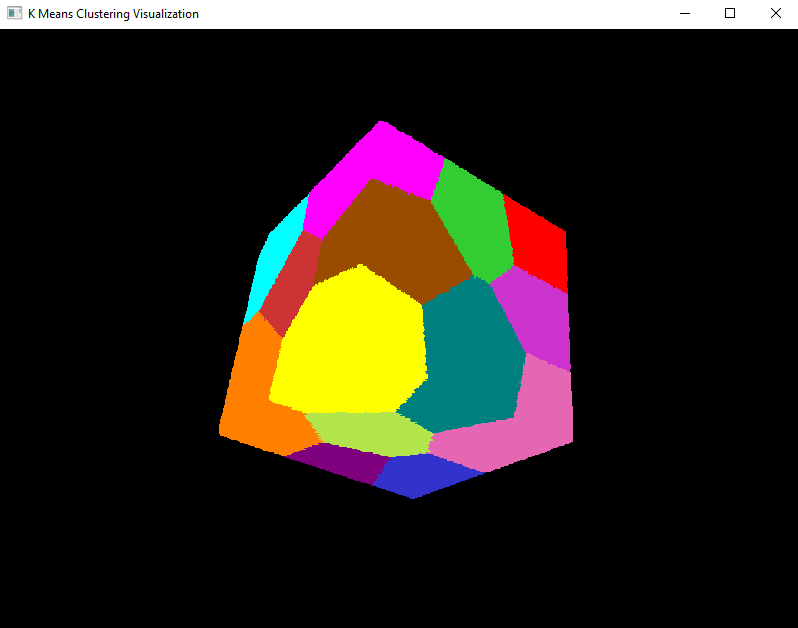
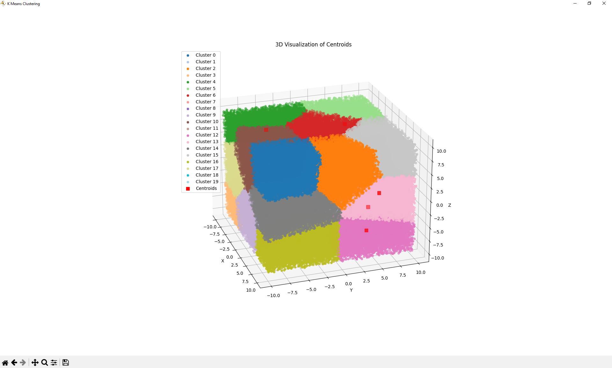

# K-Means Clustering:

Projekt został zrealizowany w ramach przedmiotu **_Procesory Graficzne w Zastosowaniach Obliczeniowych_** w trakcie zimowego semestru roku akademickiego 2024-2025 z wykorzystaniem [CUDA](https://en.wikipedia.org/wiki/CUDA).

Projekt zawiera $3$ różne implementacje [algorytmu](https://www.eecs.northwestern.edu/~wkliao/Kmeans/index.html):
- `cpu` to implementacja algorytmu wykonywana całkowicie na CPU.
- `gpu1` to implementacja z wykorzystaniem własnych funkcji wykonywanych na karcie graficznej.
- `gpu2` to alternatywna implementacja korzystająca z [biblioteki Thrust](https://nvidia.github.io/cccl/thrust/index.html#).

## Specyfikacja danych:
- $N$ - liczba punktów ($1 \leq N \leq 50 \times 10^6$)
- $d$ - liczba wymiarów przestrzeni ($1 \leq d \leq 20$)
- $k$ - liczba centroidów ($1 \leq k \leq 20$)

## Format danych wejściowych:

W programie zaimplementowana dwa formaty danych wejściowych.

### Format tekstowy:

Pierwsza linia pliku zawiera $3$ liczby naturalne, rozdzielone białymi znakami. Liczby te są interpretowane jako $N$, $d$ oraz $k$.
Następne $N$ linii jest interpretowanych jako punkty o $d$ współrzędnych. Współrzędne te powinny być rozdzielone białymi znakami.
Wśród punktów pierwsze $k$ jest interpretowanych jednocześnie jako początkowe położenia centroidów.

Przykładowo, dla $N=4$, $d=3$ oraz $k=2$ plik wejściowy wygląda następująco:

```
4 3 2
12.20  1.12  5.55
34.45  5.23  2.34
65.33  1.10  4.40
4.90   3.34  0.12
```

### Format binarny:

Format ten jest w pełni analogiczny do tekstowego. 
Pierwsze $12$ bajtów to parametry $N$, $d$ i $k$. 
Dalsze $N$ porcji danych to współrzędne kolejnych punktów, zapisane jako $4$-bajtowe liczby rzeczywiste typu `float`.

## Format danych wyjściowych:

Wyniki są zapisywane wyłącznie w formacie tekstowym. 
Pierwsze $k$ linii to współrzędne centroidów, wyznaczone przez algorytm. 
Kolejne $N$ linii zawiera pojedynczą liczbę naturalną, oznaczającą przynależność punktu do odpowiedniego centroidu (kolejność punktów odpowiada danym wejściowym).

Przykładowo, dla $N=4$, $d=3$ oraz $k=2$ plik wyjściowy może wyglądać następująco:

```
12.20  1.12  5.55
34.45  5.23  2.34
0
1
2
1
```

## Uruchomienie programu:

```c
KMeans data_format computation_method input_file output_file
```

Program pobiera 4 parametry pozycyjne:
- `data_format`, który określa format danych wejściowych (`txt`|`bin`)
- `computation_method`, który określa zastosowany algorytm (`cpu`|`gpu1`|`gpu2`)
- `input_file`, który określa ścieżkę do pliku wejściowego w odpowiednim formacie
- `output_file`, który określa ścieżkę do pliku wyjściowego
  - jeżeli plik nie istnieje, to zostanie utworzony
  - w przyciwnym przypadku jego zawartość zostanie nadpisana przez aktualne wywołanie programu

## Wizualizacja:

Dla $d=3$ po zakończeniu obliczeń automatycznie uruchamiana jest wizualizacja wyniku działania algorytmu.
Użytkownik może obracać zbiór punktów w przestrzeni $3$-wymiarowej oraz zmieniać rozmiar okna.

Pozycja kamery jest jest wyznaczana dynamicznie na podstawie aktualnego zbioru danych, aby zapewnić widoczność wszystkich punktów rozważanego zbioru.

<p align="center">
  
</p>

Wizualizacja została zaimplementowana z wykorzystaniem [OpenGL](https://pl.wikipedia.org/wiki/OpenGL). 
Wszystkie potrzebne zależności zostały umieszczone w repozytorium i skonfigurowane w projekcie.

<p align="center">
  
</p>

Dodatkowo `KMeans.Visualization` zawiera skrypt do wizualizacji wyniku działania algorytmu w języku [Python](https://www.python.org/) oraz skrypt pozwalający na wygenerowanie przykładowego pliku wejściowego.

<p align="center">
  
</p>

## Author:

My GitHub: [@adamgracikowski](https://github.com/adamgracikowski)

## Contributing:

All contributions, issues, and feature requests are welcome! 🤝

## Show your support:

Give a ⭐️ if you like this project and its documentation!
