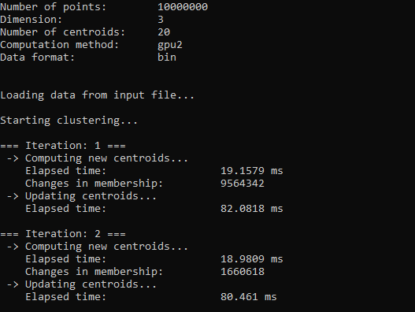

# K-Means Clustering:

This project demonstrates the implementation of the K-Means clustering algorithm using three different approaches: 
- CPU-based computation, 
- GPU computation using custom CUDA kernels, 
- and GPU computation utilizing the Thrust library. 

The goal is to compare the performance and efficiency of these methods in clustering large datasets.

The project was implemented as a part of the Graphic Processors in Computational Applications course at Warsaw University of Technology during the winter semester of the 2024-2025 academic year.

  

## Features:

## Prerequisites:

## Running the Program:

## Input Format:

## Output Format:

## Visualization:

  

  

  

## Author:

My GitHub: [@adamgracikowski](https://github.com/adamgracikowski)

## Contributing:

All contributions, issues, and feature requests are welcome! 🤝

## Show your support:

Give a ⭐️ if you like this project and its documentation!